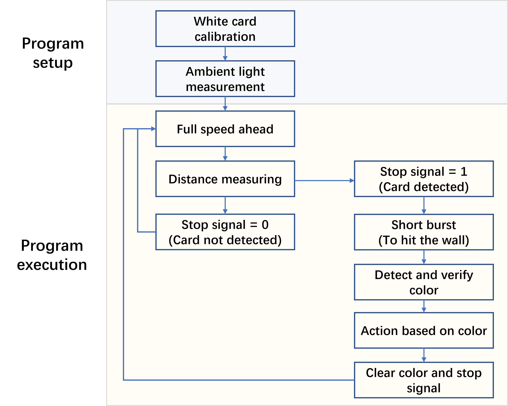
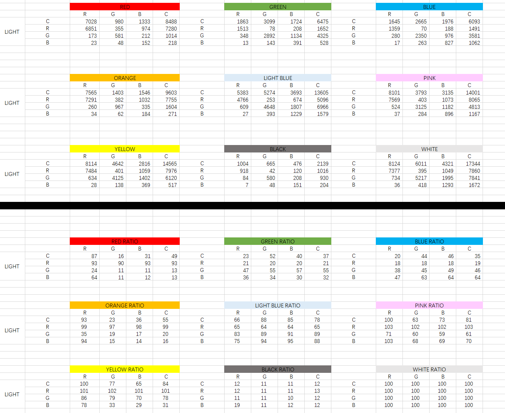
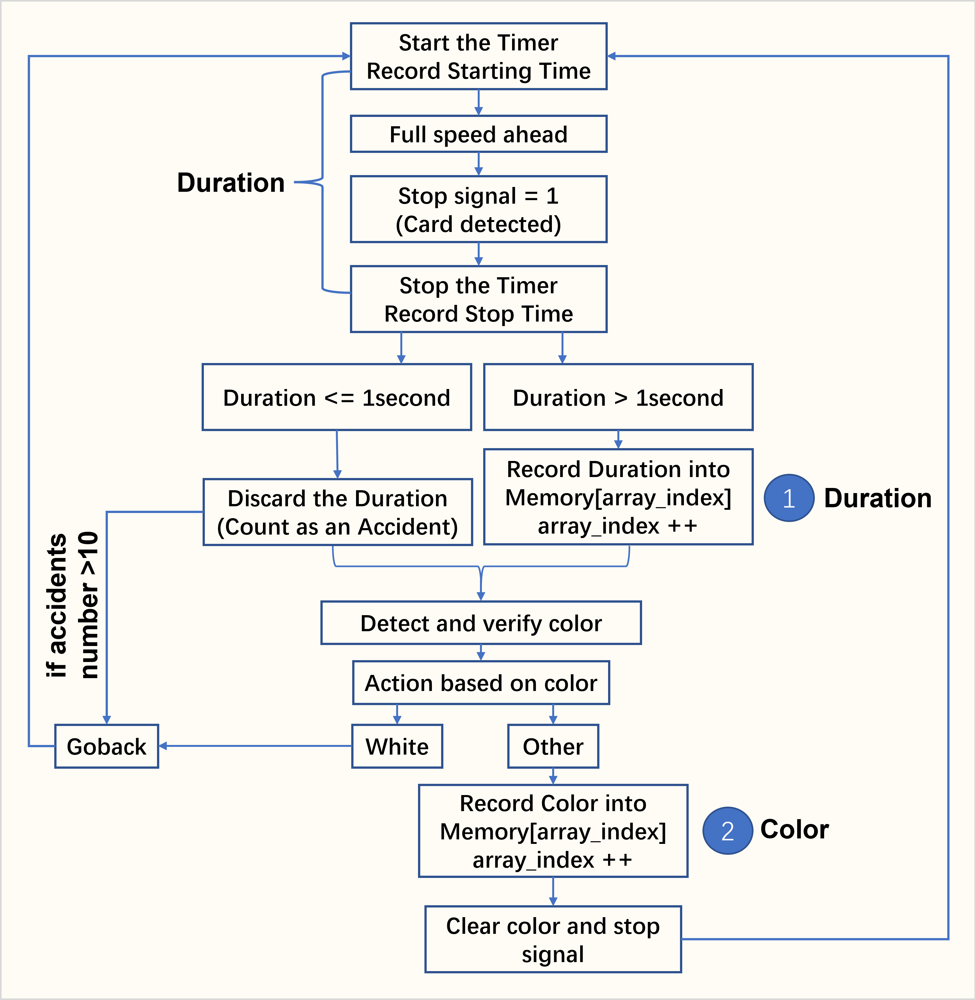
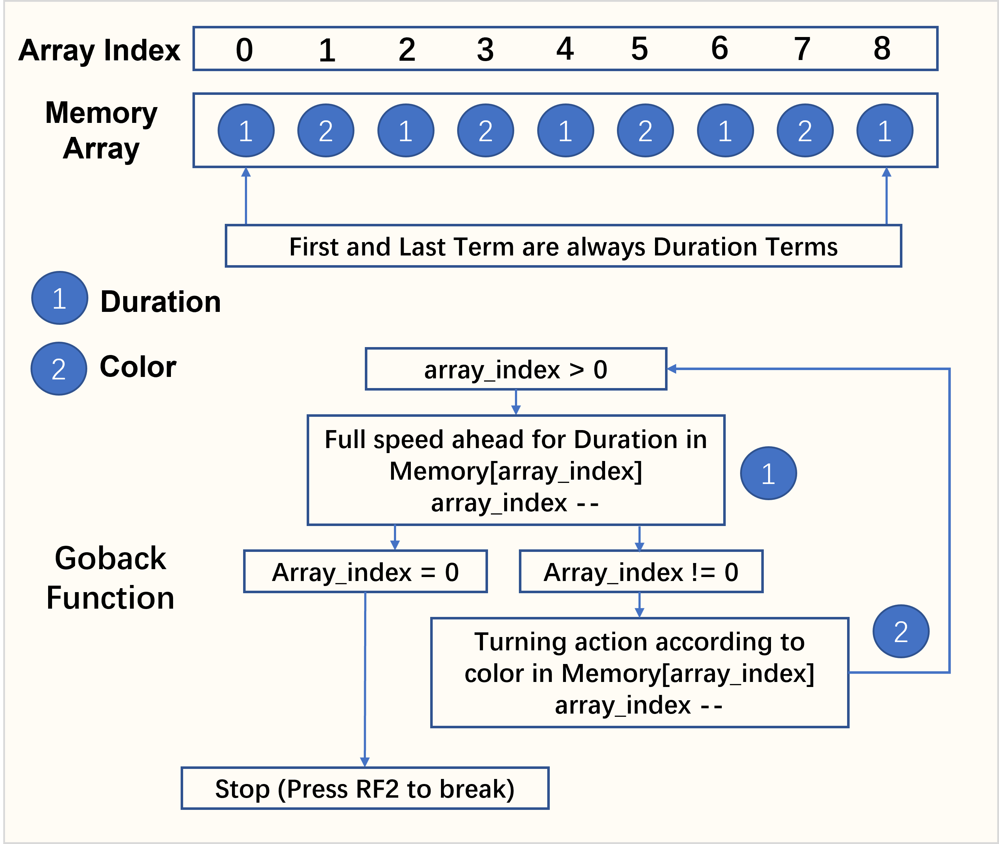

# Course project - Mine navigation search and rescue

## Challenge brief

Your task is to develop an autonomous robot that can navigate a "mine" using a series of instructions coded in coloured cards and return to its starting position.  Your robot must be able to perform the following: 

1. Navigate towards a coloured card and stop before impacting the card
1. Read the card colour
1. Interpret the card colour using a predefined code and perform the navigation instruction
1. When the final card is reached, navigate back to the starting position
1. Handle exceptions and return back to the starting position if final card cannot be found

## Demonstration

Youtube link: https://www.youtube.com/watch?v=E8A-zQ6wuDk

## Project management and document control

Table 1: Job allocation

Kangan Chen | Yuhai Jin 
---------|--------- 
Color data analysis and collection | Motor settings
Color recognition | Motor calibration
Test development | Buggy motion control
Program setup development | Buggy back track function
Video filming and editing | Readme file editing
 

Table 2: Documents and applications

Document | Application 
---------|--------- 
main.c | Contains the basic logic of the buggy motion  
color.c | Contains functions to initialize Color Click, control the LED lights and detect colors  
dc_motor.c | Contains functions to control the basic motion of the motor/ Buggy, e.g., moving forward and backward, and turning 
i2c.c | Contain functions to communicate between microcontrollers and peripheral integrated circuits 
interrupt.c | Contains functions to initialize interrupts 
movement.c | Contains functions to control the complex motion of the Buggy, allowing the Buggy to move correctly when detecting color 
serial.c | Contains functions to send and receive data from PC 
test_and_calibration.c | Contains functions to calibrate the color sensing and motor and tests 
timers.c | Contains functions to record the time 

## Common variables

Table 3: Common variables and meanings

 | | R reading  | G reading | B reading  | C reading | 
| :------------: |:---------------:| :------------: |:---------------:|:---------------:| 
| White light | CR | CG | CB | CC|  
| Red light   | RR | RG | RB | RC | 
| Green light | GR | GG | GB | GC | 
| Blue light | BR | BG| BB | BC | 

Table 1 shows 16 variables used in the program. This section aims to explain the meaning of these variables to prevent confusion when reading this document. The Color Click sensor can turn on 4 different lights, which are red light, green light, blue light, and white light (a combination of other 3 lights). Meanwhile, the sensor can also capture 4 different readings, which are R, G, B and C. In total, 16 variables in Table 1 can be generated by switching on different lights and obtaining different readings. For example, BR means turning on the blue light and capturing the R reading; CB means turning on the white light and capturing the B reading. 

## General logic of the program

This session introduces the general logic flow of the program. More details will be discussed in "Program setup" session and "Methodology" session.

Power on the buggy, the first thing is starting the basic program setup, including white card calibration, ambient light measurement, and motor calibration(optional). After finishing the basic program setup, press RF2, and the main program execution starts. The buggy will keep moving forward until the detect-wall function tells it to stop (stop signal == 1).  Once it stops (card detected), the buggy will do a short burst to hit the wall, and then detect and verify the color. After the color has been verified, the buggy will react according to the color. The color and stop signal are cleared, and the buggy will move forward to explore the maze. All the actions, both forward moving and turning are memorized for back track purposes.  

## Program setup 

When the buggy is switched on, some calibrations are required.  

### Calibration 1: White color calibration 

When the RF2 is pressed, the white color calibration is triggered. The user needs to show the Color Click a white card and the Color Click will turn on white, red, green and blue lights consecutively to take R, G, B and C readings. The white card data will be stored in a structure, named white_card.  

### Calibration 2: Ambient light measurement 

When RF3 is pressed, the ambient light measurement will be triggered, and the CC value from the surrounding is measured and stored.  

### Calibration 3 (Optional): Motor power calibration 

After the measurement of the ambient light, the user can choose to start the maze directly by pressing the RF2. Optionally, the user can press RF3 to trigger the motor power calibration. During the motor power calibration, both LED RD7 and RH3 will turn on. The user can press RF2 to increase the turning sensitivity or press RF3 to decrease the turning sensitivity. After setting the turning sensitivity, the user can press both RF2 and RF3 to trigger the test function. The buggy will turn left and right multiple times to demonstrate the turning effect after changing the sensitivity. Once the testing function is completed, the user can press RF2 to start the maze or press RF3 again to recalibrate the motor. 

## Methodology 

### Detect-wall function 

[Relevant files: color.c] 

The detect-wall function allows the buggy to stop moving when detecting the presence of a colored card or wall. When a card is detected, the function will set the stop_signal to 1, which will trigger the color detection function and further movements. This effect is achieved by detecting the ambient light. During the program setup stage, the ambient light is measured and stored in a CC value (see table X). When the buggy approaches a card, due to the increase in reflection, the CC value measured by the buggy will increase. When the ambient light exceeds the 1.1 times of the CC value measured at the setup stage, the stop_signal will be changed from 0 to 1, instructing the buggy to stop. 

### Color detection function 

[Relevant files: color.c] 

The color-detection is achieved by analyzing the RGBC data with RGBC lights. When detecting color, we switched on the red, green, and blue lights consecutively on every colored card and measured the R, G and B data from the Color Click. For each card, we will obtain 9 different data as shown in table X (RR, RG, RB, BR, BG, BB, GR, GB, GG). The color detection algorithm is designed by analyzing the 9 variables. To reduce the influence of ambient light, only the ratios between the RGBC data of the colored card and the RGBC data of the white card are stored.  

### Motor turning 

[Relevant files: motor.c] 

The most basic turning angle is 45 degrees. Turning 90 degrees requires repeating the turning function twice and turning 135 degrees requires repeating the turning function thrice etc. This method is beneficial because we only need to calibrate the motor setting for one angle. As long as the 45-degree turning is accurate, 90, 135 and 180 degrees will also be accurate. The turning sensitivity can be adjusted and tested by using the calibration function in program setup. 

### Forward movement memory

[Relevant files: main.c, timer.c, interrupt.c] 

The timer starts right before the buggy moves forward. The starting time is recorded at the same time as the timer is started. Once the card/wall is detected, the buggy will stop. The timer is also stopped and stop time is recorded. The duration of forward movement (stop time - start time) compared to 1 second. If the duration is larger than 1 second, the forward movement duration is valid and will be recorded in the memory array at the current array index. The array index is then plus 1 for next recording. If the duration is less than 1 second, the forward movement is considered as an accident, and it will not be recorded in the memory array. If the accident happens more than 5 times, the buggy is identified as lost, it will call the goback function and go back to the starting point. 

###  Turning memory

[Relevant files: movement.c] 

After the color card is detected and verified, the turning action is taken according to the color. If color is white, goback function is called and the buggy will go back to the starting point. If it is other color, the turning action will be recorded in the memory array at the current array index. The array index is then plus 1 for next recording. After that, color and stop signal are cleared. The loop repeats, and timer is started again for duration recording purposes. 

###  Goback function

[Relevant files: movement.c] 

From forward movement memory and turning memory logic, the first and the last term of the memory array are always duration terms. Before starting the loop, read the memory array for the current array index(memory[array_index]), and it should represent the last term (duration term) of the memory array. Ask buggy to move forward for the duration memorized, and minus 1 array index for next reading. Read the memory array for the current array index(memory[array_index]), and it should represent the last term (color term) of the memory array. Ask buggy to turn certain angles according to the color term, and minus 1 array index for next reading. The loop repeats until array index == 0. In this case, all data in the memory array has been read, and the car will stop. Press RF2 to start the buggy, it will go the main function, recording and detecting again. 

## "Mine" environment specification

A "mine" is contstructed from black plywood walls 100mm high with some walls having coloured cards located on the sides of the maze to assist with navigation. The following colour code is to be used for navigation:

Colour | Instruction
---------|---------
Red | Turn Right 90
Green | Turn Left 90
Blue | Turn 180
Yellow | Reverse 1 square and turn right 90
Pink | Reverse 1 square and turn left 90
Orange | Turn Right 135
Light blue | Turn Left 135 
White | Finish (return home)
Black | Maze wall colour

Mine courses will vary in difficulty, with the simplest requiring 4 basic moves to navigate. More advanced courses may require 10 or moves to navigate. The mines may have features such as dead ends but colour cards will always direct you to the end of the maze. Once the end of the maze has been reached, you must return to the starting position. An example course to navigate is shown below. You do not know in advance which colours will be in the course or how many.

